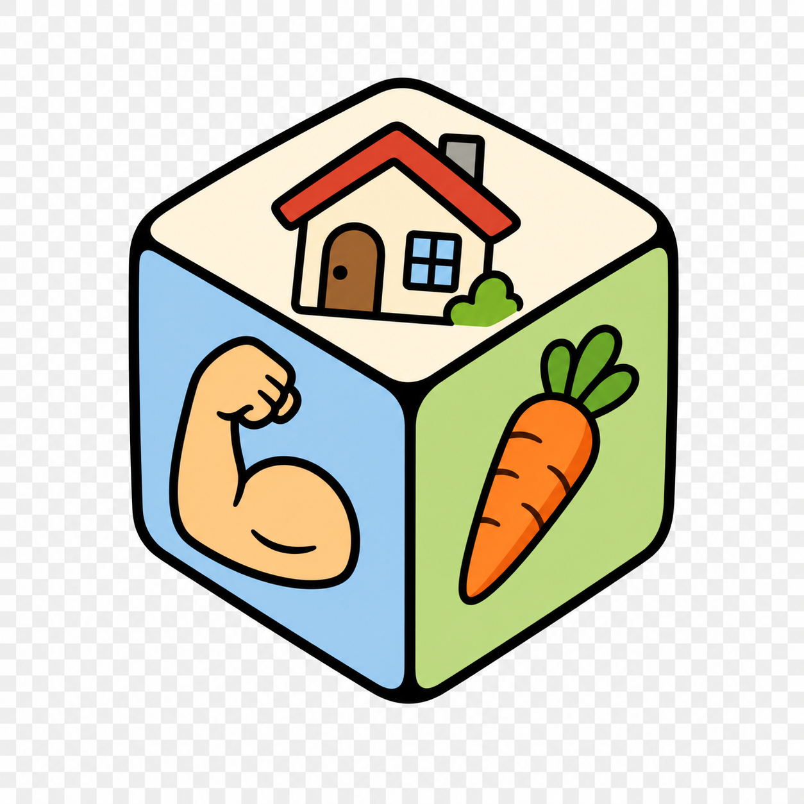

# what-town-two-words

> :warning: :robot: this tool was vibe coded with Codex

<p align="center">
  
</p>

A local, hackable `town.word.word` encoder inspired by what3words-style codes,
but built from your own word list and British town names.

The package includes:

- optional user-supplied blacklist filtering
- optional CMUdict homophone rejection via `pronouncing`
- minimum Levenshtein distance filtering
- optional metaphone collision rejection via `Metaphone`
- plural/singular pair rejection
- reversible integer and approximate lat/lon grid encoding

## Install

```bash
python3 -m pip install -e ".[phonetics,dev]"
```

The package works without optional dependencies, but CMUdict and true metaphone
checks are best with `.[phonetics]`.

## Quick Use

```python
from what_town_two_words import LexiconBuilder, LocalWhat2Words

words = ["meeting", "penguin", "klutz", "button", "rocket", "pickle"]
towns = ["Bristol", "York", "Bath"]

lexicon = LexiconBuilder(min_levenshtein=3).build(words)
coder = LocalWhat2Words(towns=towns, words=lexicon.words)

code = coder.encode_int(12)
assert coder.decode_code(code) == 12
```

For coordinates:

```python
coder = LocalWhat2Words.from_builtin()
code = coder.encode_latlon(51.5074, -0.1278, resolution_m=5000)
cell = coder.decode_latlon_code(code, resolution_m=5000)
print(code, cell.center)
```

## Comedy Scoring Experiment

There is experimental Ollama helper code for scoring words by comic,
positive, or smile-value. It was used to explore the "funny" angle of the word
list, not as a required part of the build pipeline.

Run a small local model, for example:

```bash
ollama pull llama3.2:1b
```

Then:

```python
from what_town_two_words import score_words_with_ollama

scores = score_words_with_ollama(
    ["meeting", "penguin", "klutz"],
    model="llama3.2:1b",
)
```

The expected direction for the comedy experiment is:

```text
meeting < penguin < klutz
```

Treat these scores as exploratory data. The normal build should rely on word
rank, morphology, and collision filters rather than broad LLM weighting.

## Data Pipeline

```bash
what-town-two-words extract-towns data/parsed/os-open-names/*.csv \
  --include-multiword \
  --out data/build/city-towns-villages-hamlets.txt

what-town-two-words extract-towns data/parsed/os-open-names/*.csv \
  --include-multiword \
  --allowed-type City \
  --allowed-type Town \
  --out data/build/cities-towns.txt

what-town-two-words extract-scowl data/parsed/scowl/final/english-words.* \
  --out data/build/candidate_words.txt

what-town-two-words filter-kaikki \
  --kaikki data/parsed/kaikki/kaikki.org-dictionary-English.jsonl.gz \
  --words data/build/candidate_words.txt \
  --out data/build/morph_words.txt \
  --metadata-out data/build/morph_metadata.tsv \
  --rejected-out data/build/morph_rejected.tsv

what-town-two-words extract-scowl-ranked \
  --db data/parsed/scowl/wordlist/scowl.db \
  --out data/build/word_ranks.tsv \
  --max-size 60 \
  --spelling B

what-town-two-words build \
  --words data/build/morph_words.txt \
  --ranks data/build/word_ranks.tsv \
  --out data/build/filtered_words.txt \
  --rejected-out data/build/rejected_words.tsv

what-town-two-words encode-int 12345 \
  --words data/build/filtered_words.txt \
  --towns data/build/city-towns-villages-hamlets.txt

what-town-two-words encode-latlon 51.5074 -0.1278 \
  --words data/build/filtered_words.txt \
  --towns data/build/city-towns-villages-hamlets.txt

```

Use `data/build/cities-towns.txt` instead for a stricter City/Town-only first
component.

This is intentionally local-first: no central lookup service, no remote API, and
no baked-in global address database.

The bundled lists are only seeds for demos and tests. For fine coordinate
resolutions, use a larger filtered word list so `town_count * word_count^2`
comfortably exceeds the number of grid cells in your chosen bounding box.

When collision filters find similar words, the builder processes lower-ranked
words first, so the more common/preferred word is kept. SCOWL `size` is a coarse
rank where lower means more common. A stronger corpus-frequency rank file in
`word<TAB>rank` format should still be preferred whenever available.

## Design Notes

This project came out of a few experiments rather than a finished theory.
The current bias is deliberately collision-first:

- **First component:** OS Open Names settlements. The broad file keeps `City`,
  `Town`, `Village`, `Hamlet`, `Suburban Area`, and `Other Settlement`; the
  stricter alternative keeps only `City` and `Town`.
- **Word source:** SCOWL/ESDB British words, with SCOWL `size` used as a rough
  commonness rank. Lower SCOWL size wins collisions before any aesthetic
  preference is considered.
- **Morphology:** Kaikki/Wiktionary JSONL can remove inflected junk more
  cleanly than suffix rules. The intended policy keeps noun lemmas, adjective
  lemmas, and gerunds/present participles; it rejects plurals, pure adverbs,
  pure base verbs, third-person forms, past forms, and most comparative or
  superlative forms.
- **Collisions:** words are removed if they are too close by Levenshtein
  distance, share a metaphone key, are CMUdict homophones when that optional
  dependency is installed, appear in a user-supplied blacklist, or are
  plural/singular collisions.

The "funny" angle was an experiment, not a production rule. Early experiments
used an Ollama model to score words for fun/comical/positive energy, but broad
scoring was too noisy and risked skewing the address space. The working
definition of smile-value preferred, in order:

1. Directly comic or playful meanings: `tickle`, `giggle`, `joke`, `clown`,
   `farce`.
2. Comic mishap, awkwardness, slapstick, embarrassment, lewdness, bodily comedy,
   or haplessness: `klutz`, `wobble`, `pratfall`, `bonk`.
3. Words frequent in jokes, pub chat, comic scenes, innuendo, or stock comic
   situations: `bar`, `priest`, `banana`, `trousers`.
4. Cute, endearing, or inherently odd referents: `penguin`, `aardvark`.
5. Funny sound or mouthfeel: `pickle`, `noodle`, `kazoo`.
6. Neutral vivid concrete words: `rocket`, `lantern`.
7. Abstract, administrative, technical, medical, hostile, or bleak words, unless
   the concept itself is comic.

This means `tickle` scored above `pickle` in the comedy experiment, while
clearly more common words still belong ahead of funnier rare words in the actual
address vocabulary.
